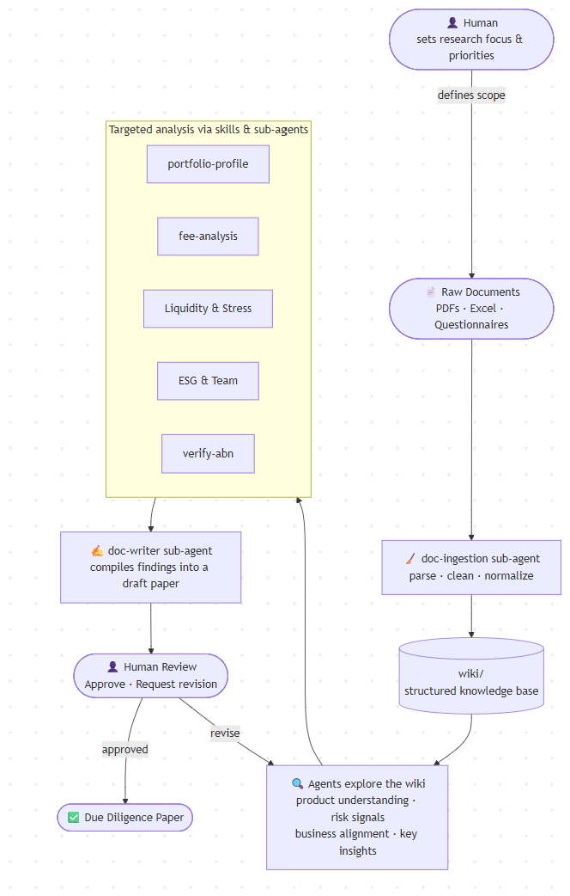

# Dossier

**An AI agent system for investment due diligence.**

Dossier turns weeks of manual due diligence (DD) work into a guided, auditable workflow, built on Claude Code with specialised sub-agents and skills.

> Demo project. Built to show how I'd frame and structure an agentic solution to a real, high-stakes client problem.

---

## The Problem 

Before a managed portfolio is approved on a wealth platform, an investment team has to read through hundreds of pages of source material - Investment Manager Questionnaires, PDSs, fact sheets, fee schedules, meeting recap and other relevant information.

In practice this means:

- **Delayed revenue:** New products are a strong contribution to business cash flow. During peak season, the business has to delay product launch by at least a month to accomodate researchers' workload.
- **Inconsistent depth:** Different analysts surface different signals; coverage of fees, liquidity, and ESG varies.
- **Hard to audit:** When a finding is challenged, tracing it back to the exact source page or cell is painful.
- **Document chaos:** The same fact lives across an Excel questionnaire, a PDF disclosure, and a marketing deck that are often disagreeing.

Generic chatbots don't solve this. They hallucinate, they lose context across long documents, and they can't be governed for a regulated, client-facing process.

---

## The Approach

Rather than one large prompt, the work is split across **specialised agents and skills**, each with a narrow job and a clear boundary. This mirrors how a real DD team actually operates. Junior analysts ingest and clean, specialists drill into fees or ESG, a senior writer compiles, and a human reviews before anything goes out.

Three design choices drive the framework:

1. **Ground every output in a cleaned knowledge base.** Raw documents are parsed once into a structured `wiki/` and never read directly again. This stops the model from hallucinating and gives every claim a traceable source.
2. **Separate "extract" from "analyse" from "write."** Different agents, different models, different cost profiles. Cheap models do parsing; stronger models do reasoning and drafting.
3. **Keep humans in the loop where it matters.** The analyst sets scope at the start and reviews the draft at the end. The agents do the legwork in between.

---

## Agent Workflow



**How a run flows:**

1. **Human sets scope.** Which portfolio, which areas to focus on (e.g. fees, liquidity, ESG).
2. **`doc-ingestion`** parses raw PDFs, Excel questionnaires, and decks into clean, structured artifacts in `wiki/`.
3. **Specialist skills and sub-agents** analyse the wiki for their slice of the problem: `portfolio-profile`, `fee-analysis`, liquidity & stress, ESG & team, ABN verification.
4. **`doc-writer`** compiles findings into a draft DD paper.
5. **Human reviews.** Approve, or send back with revision notes that re-trigger the relevant agents.

---

## Real-World Challenges It Addresses

| Challenge in DD work | How the framework handles it |
| --- | --- |
| Hallucinated facts in regulated outputs | Agents read only from cleaned `wiki/` files; the IM Questionnaire is the authoritative source when present |
| Same fact, different documents, different numbers | Ingestion normalises and labels each source; conflicts are surfaced rather than silently picked |
| "Where did this number come from?" audits | Every wiki file keeps source metadata; logs in `log.md` track every ingest, query, and edit |
| Long, mixed-format documents | Heterogeneous parsers per format (xlsx, pdf, docx, pptx) feed a uniform JSON layer |
| Cost and latency on large docs | Cheap models for parsing/cleaning, stronger models reserved for analysis and drafting |
| Quality drift across analysts | Skills encode a fixed methodology, so every portfolio gets the same depth of review |

---

## What It Produces

- A **Highly Customisable Due Diligence Paper** (Word) covering portfolio profile, fees, liquidity, stress testing, ESG, team, and verification checks. 
- A **structured knowledge base** (`wiki/`) that future runs and analysts can re-use.
- An **audit trail** of what was ingested, when, and which agent touched it.

---

## Project Structure

```
.
├── .claude/
│   ├── agents/                  # Specialised sub-agents
│   │   ├── doc-ingestion/       # Parse & clean raw documents into wiki/
│   │   ├── doc-writer/          # Compile DD paper sections
│   │   ├── fee-search/          # Pull fees from public sources (e.g. PDS)
│   │   └── cleaner/             # Maintain wiki/ hygiene
│   └── skills/                  # Targeted analysis modules
│       ├── portfolio-profile/   # Strategy, allocation, risk, rebalancing
│       ├── fee-analysis/        # Fee calc & benchmarking
│       ├── paper-writing/       # DD paper structure & methodology
│       ├── verify-abn/          # ABN compliance check
│       ├── pdf/ docx/ xlsx/     # Format-specific extraction helpers
│       └── portfolio-profile/
├── wiki/                        # Cleaned, structured knowledge base
├── raw_document/                # Untouched source files (gitignored)
├── output/                      # Generated DD papers (gitignored)
├── image/                       # Diagrams
├── CLAUDE.md                    # Working principles & knowledge index
├── log.md                       # Append-only activity log
└── README.md
```

---

## Why This Matters for the Client

For a wealth platform or asset consultant, this isn't a productivity gimmick. It's about **getting more portfolios reviewed, more consistently, with a defensible paper trail**. The same pattern (ingest, specialise, compile, review) ports cleanly to other regulated workflows: credit memos, vendor risk, fund onboarding, compliance reviews.

The interesting work isn't the model. It's the **framework around it**: how you scope agents, where you place the human, how you keep outputs grounded, and how you make the whole thing auditable.

---

## License

Project-specific. See `CLAUDE.md` for working principles.
